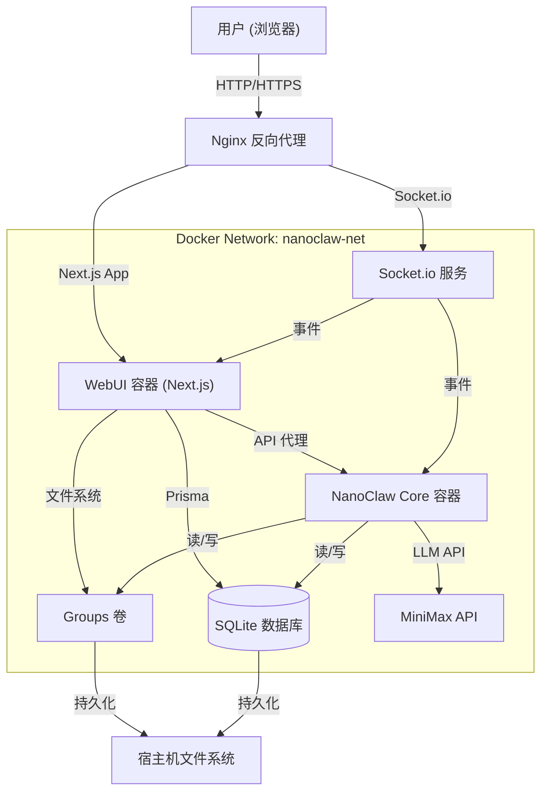
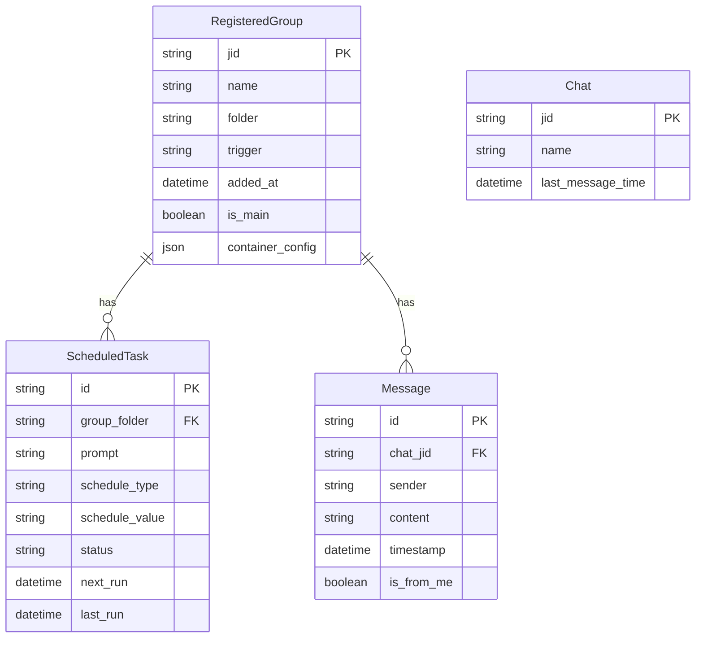

# NanoClaw WebUI 系统设计

## 1. 系统架构

NanoClaw WebUI 采用现代化的解耦架构，专为私有化部署和实时交互设计。它与现有的 NanoClaw Core 无缝集成，同时提供丰富的用户界面。

### 1.1 高层架构图



### 1.2 组件交互

1.  **前端 (Next.js App Router)**: 处理 UI 渲染、认证和用户交互。
2.  **后端 (Next.js API Routes)**: 作为 BFF (Backend for Frontend)，通过 Prisma 处理数据库操作和文件系统操作。
3.  **实时层 (Socket.io)**: 管理聊天流和 Agent 状态更新的双向通信。
4.  **数据层**:
    - **SQLite**: 用于持久化结构化数据（Agent、任务、消息）的共享数据库。
    - **文件系统**: 存储 Agent 配置 (`CLAUDE.md`, `sender-allowlist.json`) 和上传的图片。
5.  **NanoClaw Core**: 现有的 Agent 运行时，在单独容器中运行，但共享数据卷和网络。

## 2. 数据库设计

### 2.1 实体关系图 (ERD)



### 2.2 Prisma Schema

```prisma
datasource db {
  provider = "sqlite"
  url      = "file:/workspace/project/store/messages.db"
}

generator client {
  provider = "prisma-client-js"
}

model RegisteredGroup {
  jid             String   @id
  name            String
  folder          String
  trigger         String
  added_at        DateTime @default(now())
  is_main         Boolean  @default(false)
  container_config String? // JSON 字符串

  tasks           ScheduledTask[]
  messages        Message[]

  @@map("registered_groups")
}

model ScheduledTask {
  id              String   @id @default(uuid())
  group_folder    String
  chat_jid        String
  prompt          String
  schedule_type   String   // cron, interval, once
  schedule_value  String
  status          String   // active, paused
  next_run        DateTime?
  last_run        DateTime?
  created_at      DateTime @default(now())

  group           RegisteredGroup @relation(fields: [chat_jid], references: [jid])

  @@map("scheduled_tasks")
}

model Message {
  id              String   @id @default(uuid())
  chat_jid        String
  sender          String
  content         String
  timestamp       DateTime @default(now())
  is_from_me      Boolean

  group           RegisteredGroup @relation(fields: [chat_jid], references: [jid])

  @@map("messages")
}

model Chat {
  jid               String   @id
  name              String?
  last_message_time DateTime?

  @@map("chats")
}
```

## 3. UI 设计

### 3.1 线框图

#### 聊天控制台

- **侧边栏**:
  - 顶部搜索栏。
  - "私聊 (Direct Messages)" 列表，带 Agent 头像和在线状态。
  - "群组 (Channels)" 列表。
  - 底部用户资料/设置。
- **主区域**:
  - 头部：Agent/群组名称，活跃状态，"查看详情"按钮。
  - 消息列表：消息气泡滚动区域。用户消息靠右，Agent 消息靠左。
  - 输入区：文本框（自动扩展），图片上传按钮，发送按钮。

#### Agent 资料页

- **头部**: 大头像，名称，可编辑的触发词。
- **标签页**:
  - **概览**: 统计信息（创建时间，最后活跃），文件夹路径。
  - **记忆**: `CLAUDE.md` 的全屏 Markdown 编辑器。
  - **任务**: 定时任务表格，带播放/暂停切换。
  - **沙箱**: 挂载路径列表，带添加/删除按钮。
  - **安全**: 白名单配置表单。

### 3.2 交互流程

1.  **发送消息**:
    - 用户输入 -> 回车 -> 乐观 UI 更新。
    - Socket.io 发送 `client:message` -> 服务端确认。
    - 服务端存入 DB -> 触发 NanoClaw Core（通过 IPC 或共享 DB 轮询）。
    - NanoClaw Core 流式输出 -> Socket.io 发送 `agent:token` -> UI 追加到最后一条消息。

## 4. 技术实现细节

### 4.1 流式响应

- **机制**: Server-Sent Events (SSE) 或 Socket.io 流。
- **实现**:
  - NanoClaw Core 将输出写入共享日志文件或 IPC 管道。
  - WebUI 后端监听此文件/管道。
  - 有新数据时，后端通过 Socket.io `agent:typing` 和 `agent:response` 推送给前端。
  - 前端累积数据块并渲染 Markdown。

### 4.2 图片处理

- **上传**:
  - POST `/api/upload` 接收 `multipart/form-data`。
  - 文件保存至 `groups/{agent_folder}/uploads/{timestamp}_{name}.ext`。
  - 返回相对于容器挂载的本地路径。
- **发送**:
  - 消息内容包含图片引用：``。
  - NanoClaw Core 解析此引用并将文件路径传递给 MiniMax API。
- **MiniMax API 交互格式**:
  - 当消息包含图片时，构建如下 Payload：
    ```json
    {
      "messages": [
        {
          "role": "user",
          "content": [
            { "type": "text", "text": "用户文本消息..." },
            {
              "type": "image_url",
              "image_url": { "url": "https://.../image.jpg" }
            }
          ]
        }
      ]
    }
    ```
  - 注意：对于私有化部署，可能需要将本地图片转换为 Base64 或提供内部可访问的 URL。

### 4.3 SQLite 并发

- **问题**: SQLite 同一时间只允许一个写入者。
- **解决方案**:
  - 启用 **WAL (Write-Ahead Logging) 模式**: `PRAGMA journal_mode=WAL;`。
  - 在 Next.js 后端使用 Prisma 单例实例。
  - 针对 `SQLITE_BUSY` 错误实现带指数退避的重试逻辑。

### 4.4 Socket.io 与 Next.js 集成

- **挑战**: Next.js App Router 优先支持 Serverless，原生不支持长连接 WS 服务。
- **解决方案**:
  - 使用单独的自定义服务器（例如使用 `http` 模块的 `server.ts`）来初始化 Socket.io。
  - 或者，如果通过 Docker 部署，运行一个独立的 Node.js 进程用于 Socket.io，通过 Redis 或内部 HTTP 与 Next.js 通信。
  - _决策_: 针对此私有化 MVP，我们将使用 **自定义服务器** (`server.ts`) 包装 Next.js 应用，允许在同一端口上同时支持 HTTP 和 WS。

#### 4.4.1 Socket.io Server 初始化示例

```typescript
import { createServer } from 'http';
import next from 'next';
import { Server } from 'socket.io';

const dev = process.env.NODE_ENV !== 'production';
const hostname = 'localhost';
const port = 3000;
const app = next({ dev, hostname, port });
const handler = app.getRequestHandler();

app.prepare().then(() => {
  const httpServer = createServer(handler);
  const io = new Server(httpServer);

  io.on('connection', (socket) => {
    console.log('Client connected', socket.id);
    socket.on('client:message', (data) => {
      // Handle message
    });
  });

  httpServer.listen(port, () => {
    console.log(`> Ready on http://${hostname}:${port}`);
  });
});
```

### 4.5 安全

- **认证**: NextAuth.js 配合 `CredentialsProvider`。
  - 从 `AUTH_SECRET` 环境变量读取哈希密码。
  - 通过 JWT（加密 Cookie）管理会话。
- **中间件**: Next.js Middleware 保护 `/api/*` 和仪表盘路由。
