# NanoClaw WebUI 设计说明（design.md）

## 0. 文档元数据

| 字段     | 内容                                 |
| -------- | ------------------------------------ |
| 文档 ID  | OSP-NCW-DESIGN-001                   |
| 版本     | v2.0                                 |
| 状态     | Draft-Ready for Review               |
| 生效日期 | 2026-03-15                           |
| 责任人   | 技术架构组 / 前端负责人 / 后端负责人 |
| 关联规格 | `specs/nanoclaw-webui/spec.md`       |

## 1. 设计目标与边界

1. 设计 MUST 对齐 Slack 交互范式，并保持 NanoClaw 私有化约束不变。
2. 设计 MUST 明确频道配置与 Agent 全局详情的职责边界。
3. 设计 MUST 提供可实现的信息架构、流程图、数据时序与权限矩阵。

## 2. 信息架构

### 2.1 页面分层图

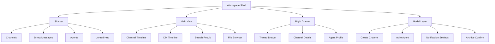

### 2.2 模块职责边界

| 模块            | MUST 包含                                    | MUST NOT 包含          |
| --------------- | -------------------------------------------- | ---------------------- |
| Channel Details | 频道元数据、成员、频道任务、频道沙箱、归档   | Agent Soul、全局白名单 |
| Agent Profile   | Soul、全局白名单、Agent 元数据、Agent 级任务 | 频道成员配置、频道归档 |
| Thread Drawer   | 线程消息流、线程未读、线程归档               | 主会话消息批量管理     |

## 3. 系统架构设计

### 3.1 组件拓扑

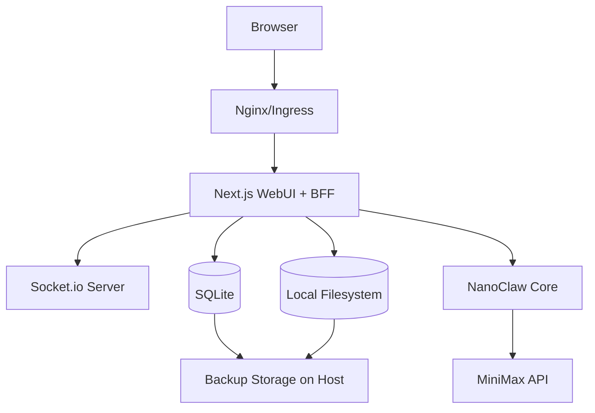

### 3.1.1 C4-Context 视图

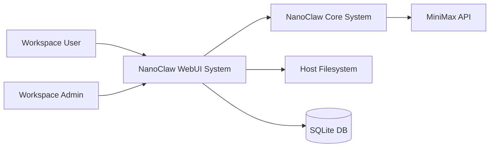

### 3.1.2 C4-Container 视图

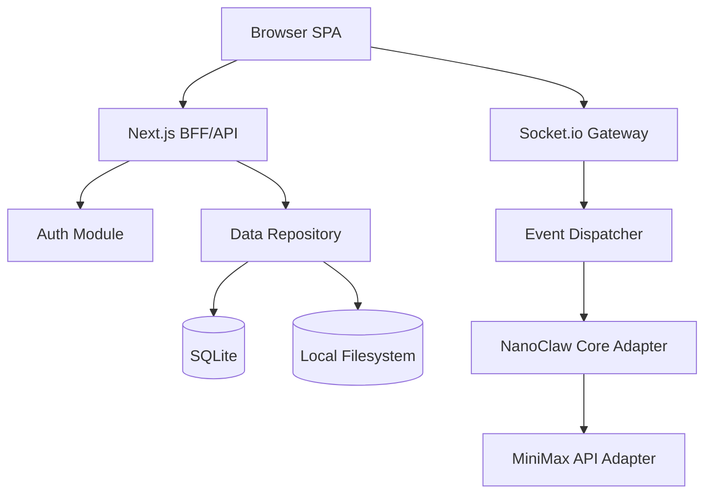

### 3.1.3 C4-Component 视图（BFF）

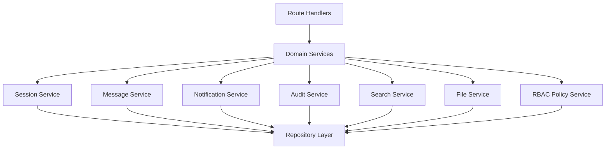

### 3.2 技术策略

1. Web 层使用 Next.js App Router；实时层使用同进程 Socket.io 或独立进程桥接。
2. 数据读写由 BFF 收敛，避免前端直连 DB 导致并发失控。
3. SQLite 启用 WAL + 重试退避；文件操作统一走安全路径校验。
4. 所有通知、未读、提及状态通过事件总线统一分发。
5. BFF 与 NanoClaw Core 职责边界 MUST 通过接口契约固定，WebUI MUST NOT 绕过 BFF 直连 Core 内部存储。

## 4. 核心交互流程

### 4.1 登录流程

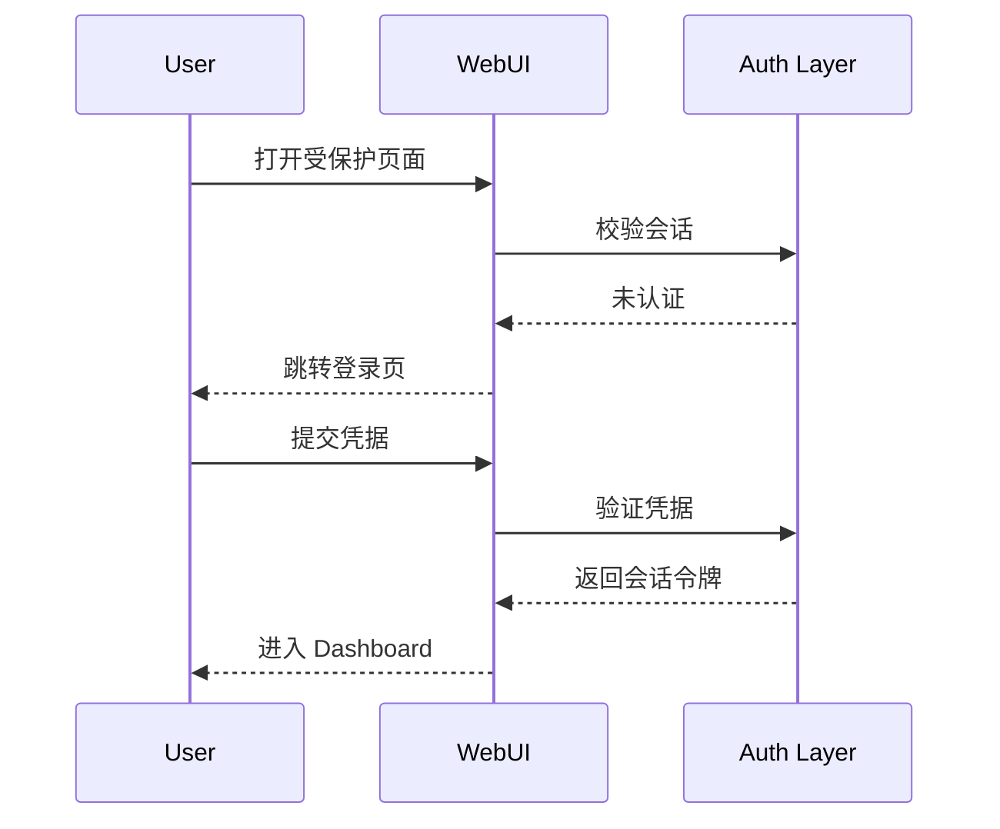

### 4.2 频道创建流程

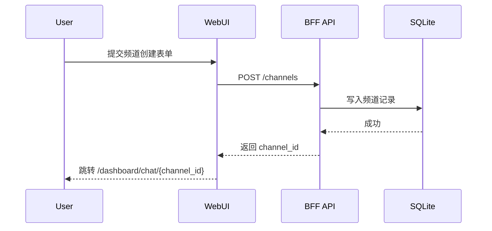

### 4.3 发起私信流程

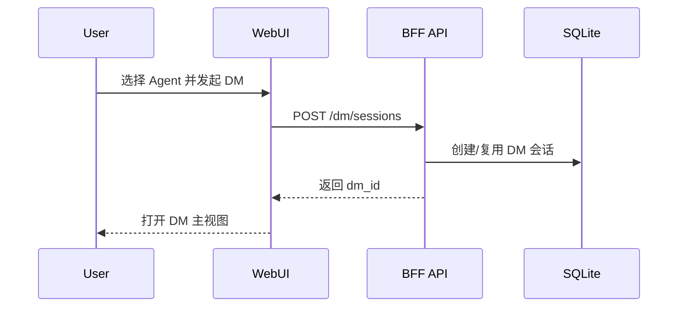

### 4.4 线程对话流程

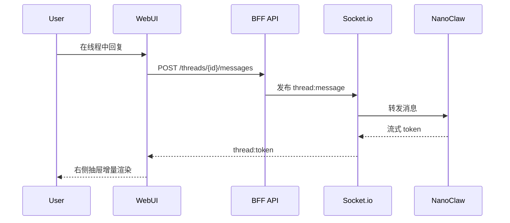

### 4.5 Agent 管理流程

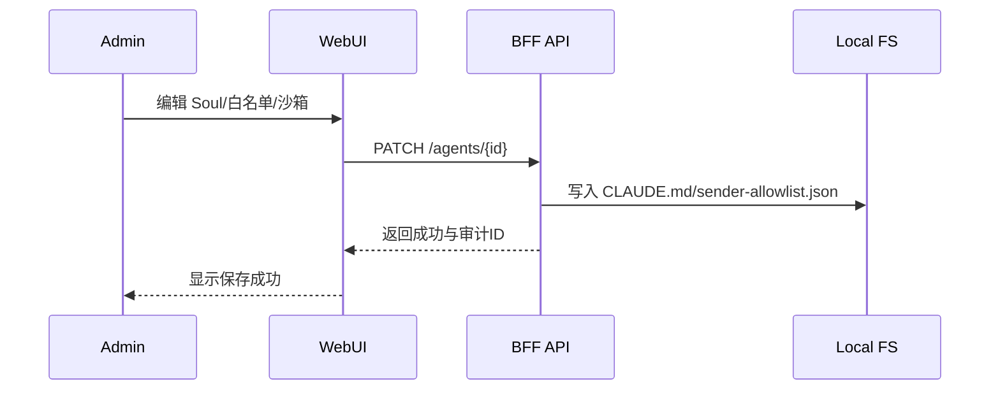

## 5. UI 组件规范（Slack 对齐）

1. 导航组件 MUST 使用三层结构：Workspace 顶栏、分组侧边栏、内容区。
2. 消息气泡 SHOULD 区分用户、Agent、系统消息三种视觉层级。
3. 输入框 MUST 支持多行输入、快捷键发送、提及补全、文件拖拽上传。
4. 右侧抽屉 MUST 用于线程与详情，避免覆盖主会话。
5. 列表组件 MUST 支持未读角标、静音标识、在线状态点。
6. 模态组件 MUST 用于高风险动作确认（归档、删除、权限变更）。

## 6. 数据流转时序

### 6.1 实时消息时序

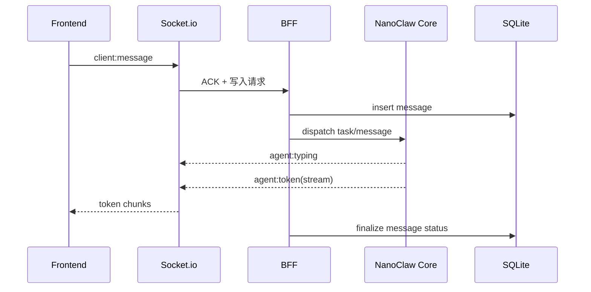

### 6.2 本地存储时序

1. 上传文件进入 BFF，进行类型和大小校验。
2. 校验通过后写入本地卷并生成元数据记录。
3. 消息引用文件 ID，而非直接拼接不安全路径。
4. 下载时通过鉴权网关回源，防止越权读取。

### 6.3 Socket 事件契约表

| 事件名 | 方向 | Payload 核心字段 | 版本 | ACK | 幂等键 | 顺序约束 |
| --- | --- | --- | --- | --- | --- | --- |
| `client:message` | Client -> Server | `message_id, session_id, text, mentions, attachments` | v1 | MUST | `message_id` | 按 `session_id + client_seq` 单调 |
| `server:ack` | Server -> Client | `message_id, status, server_ts, trace_id` | v1 | MUST | `message_id` | 必须先于 token 返回 |
| `agent:typing` | Server -> Client | `session_id, agent_id, typing_state, trace_id` | v1 | SHOULD | `session_id+agent_id+state_ts` | 与 token 同会话有序 |
| `agent:token` | Server -> Client | `message_id, token_seq, token, done` | v1 | MUST | `message_id+token_seq` | `token_seq` 严格递增 |
| `thread:message` | Client -> Server | `message_id, thread_id, text` | v1 | MUST | `message_id` | 线程内单调 |
| `notify:dispatch` | Server -> Client | `event_id, level, reason, session_id` | v1 | SHOULD | `event_id` | 可乱序，按时间戳归并 |

## 7. 数据模型分层与索引策略

### 7.1 实体分层

1. 会话层：`Channel`、`DM`、`Thread`。
2. 内容层：`Message`、`Reaction`、`Attachment`。
3. 状态层：`NotificationState`、`UnreadCounter`、`Presence`。
4. 治理层：`RoleBinding`、`AuditLog`、`RetentionPolicy`。

### 7.2 主键与索引建议

| 实体 | 主键 | 核心索引 | 设计目标 |
| --- | --- | --- | --- |
| Channel | `channel_id` | `(workspace_id, visibility, archived_at)` | 频道列表与归档检索 |
| DM | `dm_id` | `(workspace_id, member_hash, last_message_ts)` | 快速定位 1v1/Group DM |
| Thread | `thread_id` | `(root_message_id, archived_at, last_reply_ts)` | 线程抽屉与未读 |
| Message | `message_id` | `(session_id, created_ts)`、`(sender_id, created_ts)` | 时序加载与发送者过滤 |
| Reaction | `reaction_id` | `(message_id, emoji, actor_id)` 唯一 | 并发去重与计数 |
| NotificationState | `event_id` | `(user_id, read_state, created_ts)` | 通知中心与未读角标 |
| AuditLog | `audit_id` | `(workspace_id, actor_id, created_ts)`、`(object_type, object_id)` | 审计追溯 |

### 7.3 幂等与顺序保证

1. 消息幂等：`message_id` MUST 全局唯一，重复提交返回同一 ACK。
2. 线程幂等：`thread_id + message_id` MUST 作为线程写入幂等键。
3. token 顺序：`token_seq` MUST 严格递增；乱序包 MUST 按缓存重排后渲染。
4. 去重策略：客户端与服务端 MUST 双端去重，窗口 SHOULD 为 10 分钟。
5. 事件重放：重连后 MUST 基于 `last_acked_seq` 拉取增量事件。
## 8. 权限矩阵

| 操作               | 工作区管理员 | 频道管理员 | 普通成员 |
| ------------------ | ------------ | ---------- | -------- |
| 创建公开频道       | 允许         | 允许       | 允许     |
| 创建私有频道       | 允许         | 允许       | 禁止     |
| 归档频道           | 允许         | 允许       | 禁止     |
| 物理删除频道       | 允许         | 禁止       | 禁止     |
| 邀请/移除 Agent    | 允许         | 允许       | 禁止     |
| 编辑 Agent Soul    | 允许         | 禁止       | 禁止     |
| 管理白名单         | 允许         | 禁止       | 禁止     |
| 查看审计日志       | 允许         | 禁止       | 禁止     |
| 发送消息/线程回复  | 允许         | 允许       | 允许     |
| 设置个人通知与静音 | 允许         | 允许       | 允许     |

## 9. 异常处理设计

1. 断网重连：客户端 MUST 维护未 ACK 队列，重连后按消息 ID 去重补发。
2. 流式中断：UI MUST 保留已接收片段，并提供“继续生成”操作。
3. Agent 超时：系统 MUST 标记超时状态并写入审计日志。
4. API 失败：所有失败响应 MUST 返回错误码、可读信息、追踪 ID。

## 10. 部署运行约束

### 10.1 资源配额建议（单工作区最小生产规格）

| 组件 | CPU | 内存 | 磁盘IO | 说明 |
| --- | --- | --- | --- | --- |
| WebUI + BFF | 2 vCPU | 4 GB | 1000 IOPS | 包含 API 与页面渲染 |
| Socket.io Gateway | 1 vCPU | 2 GB | 500 IOPS | 高峰连接与事件广播 |
| SQLite + 文件卷 | 1 vCPU | 2 GB | 1500 IOPS | WAL 与文件索引读写 |

### 10.2 容量预估公式

1. 消息存储量 `S_msg = U * M_d * R * D`  
   其中：`U`=活跃用户数，`M_d`=人均日消息数，`R`=单条消息平均KB，`D`=保留天数。
2. 文件存储量 `S_file = F_d * F_avg * D`  
   其中：`F_d`=日上传文件数，`F_avg`=平均文件大小MB。
3. 峰值连接 `C_peak = U * K`  
   其中：`K`=并发连接系数（建议 1.2~1.5）。

### 10.3 运维门禁

1. CPU 使用率 P95 SHOULD < 70%。
2. 内存使用率 P95 SHOULD < 75%。
3. Socket 消息丢包率 MUST < 0.1%。
4. SQLite `busy_timeout` 触发率 SHOULD < 1%。

## 11. 兼容性要求

1. 浏览器兼容：Chrome/Edge 最近两个稳定版本 MUST 支持全部 P0 流程。
2. 响应式适配：宽度 1280 以上为三栏；768-1279 为双栏；767 以下抽屉化导航。
3. 部署兼容：单机 Docker Compose 与内网多容器模式 MUST 可运行。
4. 数据兼容：现有 SQLite 表与文件结构 MUST 可无损迁移。

## 12. 风险说明

1. SQLite 锁竞争风险：通过 WAL + 限流 + 写入收敛治理。
2. 文件体积增长风险：通过配额阈值与归档策略治理。
3. 交互复杂度增长风险：以统一组件协议与状态机约束复杂度。

## 13. 变更记录

| 版本 | 日期       | 变更人       | 说明                                               |
| ---- | ---------- | ------------ | -------------------------------------------------- |
| v2.0 | 2026-03-15 | 架构与文档组 | 全量重构信息架构、流程、时序、权限矩阵与兼容性约束 |
